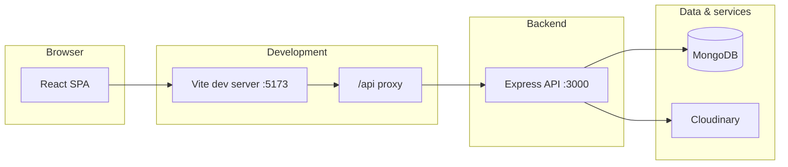

# Ink & Echo

**Ink & Echo** is a full-stack blogging platform built with the MERN stack (MongoDB, Express, React, Node.js). Authors can write rich posts with a Tiptap editor, publish or save drafts, engage through likes and bookmarks, and discuss posts in threaded comments. Readers can browse a home feed, search by keyword/category/tag, and manage their profile and saved articles.

The repository is split into two applications:

| Folder   | Role              | Default URL              |
|----------|-------------------|--------------------------|
| `client/` | React SPA (Vite) | http://localhost:5173  |
| `server/` | REST API (Express) | http://localhost:3000  |

---

## Table of contents

- [Features](#features)
- [Architecture](#architecture)
- [Project structure](#project-structure)
- [Prerequisites](#prerequisites)
- [Getting started](#getting-started)
- [Seed data](#seed-data)
- [Environment variables](#environment-variables)
- [Running the app](#running-the-app)
- [Using the application](#using-the-application)
- [Authentication](#authentication)
- [Data models](#data-models)
- [API reference](#api-reference)
- [Frontend guide](#frontend-guide)
- [Design system](#design-system)
- [Tech stack](#tech-stack)
- [Scripts reference](#scripts-reference)
- [Production notes](#production-notes)
- [Troubleshooting](#troubleshooting)

---

## Features

- **User accounts** — Register, login, logout with secure session cookies
- **Blog posts** — Create, edit, delete; publish or save as draft
- **Rich editor** — Tiptap (headings, lists, blockquotes, links, etc.) with HTML stored in MongoDB
- **Cover images** — Upload to Cloudinary (optional; required for in-app uploads)
- **Engagement** — Like and bookmark posts; view counts on profile
- **Comments** — Top-level comments and nested replies; delete by comment author or blog author
- **Discovery** — Home feed, search, category sidebar, popular tags
- **Profiles** — Public profiles with published posts; owners see liked/saved tabs and can edit name, bio, avatar
- **Read time** — Auto-calculated from word count (~200 WPM) on save

---

## Architecture



In **development**, the client calls `/api/...` on the same origin (port 5173). Vite proxies those requests to the Express server so cookies work without CORS friction.

In **production**, set `VITE_API_URL` to your API origin (e.g. `https://api.example.com`) and `CLIENT_URL` on the server for CORS.

---

## Project structure

```
BLOG/
├── README.md                 # This file — project documentation
├── client/                   # Frontend (React + Vite)
│   ├── public/               # Static assets (favicon, icons)
│   ├── dist/                 # Production build output (after npm run build)
│   ├── index.html            # HTML shell
│   ├── vite.config.js        # Vite + Tailwind + /api proxy
│   ├── eslint.config.js
│   ├── package.json
│   ├── .env.example
│   └── src/
│       ├── main.jsx          # App entry: Router, AuthProvider, Toaster
│       ├── App.jsx           # Route definitions
│       ├── index.css         # Tailwind v4 theme tokens & global styles
│       ├── api/              # Axios wrappers for backend endpoints
│       │   ├── axios.js      # Base client (credentials, 401 handling)
│       │   ├── auth.js
│       │   ├── blogs.js
│       │   ├── comments.js
│       │   └── users.js
│       ├── assets/           # SVG logos
│       ├── components/
│       │   ├── blog/         # PostCard, HeroPost, CategorySidebar
│       │   ├── comments/     # CommentThread
│       │   ├── editor/       # TiptapEditor
│       │   ├── layout/       # Layout, Navbar, Footer
│       │   └── ui/           # Button, Input, Card, Avatar, Tag, Spinner
│       ├── context/
│       │   └── AuthContext.jsx
│       ├── hooks/
│       │   ├── useAuth.js
│       │   └── useDebounce.js
│       ├── pages/            # One file per route (see [Using the application](#using-the-application))
│       └── routes/
│           └── PrivateRoute.jsx
│
└── server/                   # Backend (Express API)
    ├── server.js             # App entry: middleware, routes, listen
    ├── package.json
    ├── .env.example
    ├── config/
    │   └── db.js             # Mongoose connection
    ├── models/
    │   ├── User.js
    │   ├── Blog.js
    │   └── Comment.js
    ├── controllers/          # Request handlers
    │   ├── authController.js
    │   ├── blogController.js
    │   ├── commentController.js
    │   ├── userController.js
    │   └── uploadController.js
    ├── routes/               # Express routers mounted in server.js
    │   ├── authRoutes.js
    │   ├── userRoutes.js
    │   ├── blogRoutes.js
    │   ├── blogCommentRoutes.js
    │   ├── commentRoutes.js
    │   └── uploadRoutes.js
    ├── middleware/
    │   ├── authMiddleware.js # protect, optionalAuth
    │   └── errorMiddleware.js
    ├── utils/
    │   ├── asyncHandler.js
    │   ├── generateToken.js
    │   └── cloudinary.js
    └── seed/
        ├── seed.js           # npm run seed
        └── seedData.js       # Demo users, posts, follows, likes
```

**What is not committed / generated locally**

- `node_modules/` — install with `npm install` in each app
- `server/.env` — copy from `server/.env.example`
- `client/.env` — copy from `client/.env.example` (optional in dev)
- `client/dist/` — created by `npm run build`

---

## Prerequisites

| Requirement | Notes |
|-------------|--------|
| **Node.js 18+** | LTS recommended |
| **MongoDB** | Local (`mongodb://localhost:27017`) or [MongoDB Atlas](https://www.mongodb.com/cloud/atlas) |
| **Cloudinary** (optional) | Needed for cover/avatar uploads from the UI; posts can still use external image URLs |

---

## Getting started

### 1. Clone and open the project

```bash
cd BLOG
```

### 2. Server setup

```bash
cd server
cp .env.example .env
```

Edit `server/.env` with your MongoDB URI, a strong `JWT_SECRET`, and Cloudinary keys if you want uploads.

```bash
npm install
```

### 3. Client setup

```bash
cd ../client
cp .env.example .env
npm install
```

For local development you can leave `VITE_API_URL` empty in `client/.env` — the Vite proxy handles `/api`.

### 4. Start MongoDB

Ensure MongoDB is running and reachable at the URI in `MONGODB_URI`.

### 5. (Optional) Load demo content

From `server/`:

```bash
npm run seed
```

See [Seed data](#seed-data) for login credentials.

### 6. Run both apps

**Terminal 1 — API:**

```bash
cd server
npm run dev
```

**Terminal 2 — UI:**

```bash
cd client
npm run dev
```

Open **http://localhost:5173** in your browser. The API health check is at **http://localhost:3000/** (`{ "message": "Ink & Echo API" }`).

---

## Seed data

The seed script (`server/seed/seed.js`) clears previous seed users (emails ending in `@seed.ink-echo.app`), then creates:

- **1 admin account** (`admin@ink-echo.app`)
- **4 authors** with bios and avatars
- **9 blog posts** (8 published, 1 draft)
- **Follow relationships**, **likes**, and **bookmarks** between seed users
- **Sample comment threads** on two posts

**Password for all seed accounts:** `Password123!`

| Email | Display name | Role |
|-------|----------------|------|
| `admin@ink-echo.app` | Site Admin | **admin** |
| `elena@seed.ink-echo.app` | Elena Vasquez | user |
| `marcus@seed.ink-echo.app` | Marcus Chen | user |
| `amara@seed.ink-echo.app` | Amara Okafor | user |
| `james@seed.ink-echo.app` | James Whitfield | user |

To promote an existing user to admin without re-seeding:

```bash
cd server
npm run make-admin -- your@email.com
```

### Admin dashboard

Admins see an **Admin** link in the navbar at `/admin`. The dashboard includes:

- Platform stats (users, posts, drafts, comments, likes, bookmarks, weekly growth)
- **Users** — search, change roles, delete users
- **Blogs** — search, publish/unpublish, delete posts
- **Comments** — search and moderate comments

Categories in seed data include Writing, Culture, Technology, Travel, and Books.

---

## Environment variables

### `server/.env`

| Variable | Required | Description |
|----------|----------|-------------|
| `MONGODB_URI` | Yes | MongoDB connection string (e.g. `mongodb://localhost:27017/ink-echo`) |
| `JWT_SECRET` | Yes | Secret used to sign JWTs in the auth cookie |
| `CLIENT_URL` | Yes (prod) | Frontend origin for CORS (default: `http://localhost:5173`) |
| `PORT` | No | API port (default: `3000`) |
| `NODE_ENV` | No | `development` or `production` (affects secure cookies) |
| `CLOUDINARY_CLOUD_NAME` | For uploads | Cloudinary cloud name |
| `CLOUDINARY_API_KEY` | For uploads | Cloudinary API key |
| `CLOUDINARY_API_SECRET` | For uploads | Cloudinary API secret |

### `client/.env`

| Variable | Required | Description |
|----------|----------|-------------|
| `VITE_API_URL` | Prod only | Full API base URL (e.g. `https://api.yoursite.com`). Leave empty in dev to use the Vite proxy. |

---

## Running the app

### Development

| App | Command | URL |
|-----|---------|-----|
| Server | `npm run dev` (nodemon) | http://localhost:3000 |
| Client | `npm run dev` | http://localhost:5173 |

### Production build (client)

```bash
cd client
npm run build      # Output in client/dist/
npm run preview    # Local preview of production build
```

Serve `client/dist/` with any static host (Nginx, Vercel, Netlify, etc.) and point `VITE_API_URL` at your deployed API.

### Production (server)

```bash
cd server
NODE_ENV=production npm start
```

Set `CLIENT_URL` to your live frontend URL and use HTTPS so `secure` cookies work.

---

## Using the application

### Navigation (navbar)

| Link | Who | Purpose |
|------|-----|---------|
| **Home** | Everyone | Latest published posts, hero feature, category sidebar |
| **Search** | Everyone | Full-text search with category/tag filters |
| **Write** | Logged in | Create a new post |
| **Bookmarks** | Logged in | Posts you saved |
| **Profile** (avatar) | Logged in | Your profile and posts |
| **Login / Sign Up** | Guests | Authentication |

### Routes (pages)

| Route | Page | Access | What you can do |
|-------|------|--------|-----------------|
| `/` | Home | Public | Browse feed; filter by category from sidebar |
| `/blog/:id` | BlogPost | Public | Read article, TOC, like/bookmark (if logged in), comments |
| `/write` | Write | Private | New post: title, cover, category, tags, editor, draft/publish |
| `/edit/:id` | Write | Private | Edit your own post (author only on API) |
| `/profile/:id` | Profile | Public | View author info and published posts; owner can edit profile and see Liked/Saved tabs |
| `/bookmarks` | Bookmarks | Private | List bookmarked posts |
| `/search` | Search | Public | Search posts; debounced query; category/tag chips |
| `/login` | Login | Public | Sign in; redirects to previous page if sent from `PrivateRoute` |
| `/signup` | Signup | Public | Create account |
| `*` | NotFound | Public | 404 page |

### Typical workflows

**Read and discover**

1. Open Home → click a post card or hero.
2. Use Search or sidebar categories/tags to narrow results.

**Write a post**

1. Log in → **Write**.
2. Add title, optional cover image (upload needs Cloudinary), category, comma-separated tags.
3. Compose in the editor → **Save as draft** or **Publish**.
4. Published posts appear on Home and your profile; drafts are visible only to you.

**Engage**

- On a post: like, bookmark, comment, reply.
- **Bookmarks** in the nav lists saved posts.

**Profile**

- Visit `/profile/<your-user-id>` from the avatar menu.
- **Published** — your posts (including drafts if you are the owner).
- **Liked** / **Saved** — only visible on your own profile.

---

## Authentication

Auth uses **httpOnly cookies** named `token`, not localStorage.

| Aspect | Detail |
|--------|--------|
| Token | JWT (`userId` claim), 7-day expiry |
| Cookie flags | `httpOnly`, `sameSite: lax`, `secure` when `NODE_ENV=production` |
| Client | Axios `withCredentials: true` on all requests |
| Session check | `GET /api/auth/me` on app load (`AuthContext`) |
| Logout | `POST /api/auth/logout` clears cookie; 401 responses dispatch `auth:logout` |

Protected UI routes wrap content in `PrivateRoute`, which redirects guests to `/login` and preserves `location` for a return redirect after login.

---

## Data models

### User (`server/models/User.js`)

| Field | Type | Notes |
|-------|------|--------|
| `name` | String | Required |
| `email` | String | Unique, lowercase |
| `password` | String | Hashed with bcrypt (cost 12); not returned by default |
| `avatar` | String | URL |
| `bio` | String | Max 500 chars |
| `followers` / `following` | ObjectId[] | Populated in seed; profile shows counts (no follow UI/API yet) |

### Blog (`server/models/Blog.js`)

| Field | Type | Notes |
|-------|------|--------|
| `title`, `content` | String | HTML content from Tiptap |
| `coverImage` | String | URL |
| `author` | ObjectId → User | |
| `tags` | String[] | |
| `category` | String | |
| `likes`, `bookmarks` | ObjectId[] → User | |
| `readTime` | Number | Minutes; auto-set on content change |
| `status` | `draft` \| `published` | Drafts hidden from public feeds |

Indexes: `status` + `createdAt`, `category`, `tags`, `author`.

### Comment (`server/models/Comment.js`)

| Field | Type | Notes |
|-------|------|--------|
| `blogId` | ObjectId → Blog | |
| `author` | ObjectId → User | |
| `text` | String | Max 2000 chars |
| `parentComment` | ObjectId \| null | Null = top-level |
| `replies` | ObjectId[] → Comment | Nested thread |
| `likes` | ObjectId[] | Schema supports likes; UI may vary |

---

## API reference

Base path: `/api`. JSON request/response unless noted.

Errors return JSON `{ message: "..." }` via `errorMiddleware`.

### Auth — `/api/auth`

| Method | Path | Auth | Description |
|--------|------|------|-------------|
| POST | `/register` | No | Body: `{ name, email, password }` (password min 6 chars) |
| POST | `/login` | No | Body: `{ email, password }` |
| POST | `/logout` | No | Clears cookie |
| GET | `/me` | Yes | Current user |

### Users — `/api/users`

| Method | Path | Auth | Description |
|--------|------|------|-------------|
| GET | `/:id` | No | Public profile + `postsCount`, follower counts |
| PUT | `/:id` | Yes (owner) | Update `{ name, bio, avatar }` |
| GET | `/:id/posts` | Optional | Author's posts; drafts included only for owner |
| GET | `/:id/liked` | No | Published posts this user liked |
| GET | `/:id/bookmarks` | No | Published posts this user bookmarked |

### Blogs — `/api/blogs`

| Method | Path | Auth | Description |
|--------|------|------|-------------|
| GET | `/` | Optional | Paginated feed. Query: `page`, `limit` (max 50), `category`, `tag`, `search`, `author`, `bookmarked=true`, `liked=true` |
| GET | `/meta/categories-tags` | No | Distinct categories and popular tags |
| GET | `/:id` | Optional | Single post; adds `isLiked`, `isBookmarked`, counts when logged in |
| POST | `/` | Yes | Create post |
| PUT | `/:id` | Yes | Update (author only) |
| DELETE | `/:id` | Yes | Delete (author only) |
| POST | `/:id/like` | Yes | Like |
| DELETE | `/:id/like` | Yes | Unlike |
| POST | `/:id/bookmark` | Yes | Bookmark |
| DELETE | `/:id/bookmark` | Yes | Remove bookmark |

**Feed query examples**

```http
GET /api/blogs?page=1&limit=10
GET /api/blogs?category=Technology
GET /api/blogs?tag=travel
GET /api/blogs?search=lisbon
GET /api/blogs?bookmarked=true        # requires auth cookie
```

### Comments

| Method | Path | Auth | Description |
|--------|------|------|-------------|
| GET | `/api/blogs/:id/comments` | No | Threaded comments for a post |
| POST | `/api/blogs/:id/comments` | Yes | Body: `{ text }` |
| POST | `/api/comments/:id/replies` | Yes | Body: `{ text }` |
| GET | `/api/comments/:id/replies` | No | Replies for a comment |
| DELETE | `/api/comments/:id` | Yes | Comment author or blog author |

### Upload — `/api/upload`

| Method | Path | Auth | Description |
|--------|------|------|-------------|
| POST | `/` | Yes | `multipart/form-data` field `image`; max 5 MB; returns `{ url }` |

Requires Cloudinary env vars; otherwise `503` with a configuration message.

---

## Frontend guide

### Entry and routing

- `main.jsx` — `BrowserRouter`, `AuthProvider`, global `Toaster` (react-hot-toast).
- `App.jsx` — Nested routes under `Layout` (navbar + footer + `<Outlet />`).
- `PrivateRoute.jsx` — Blocks unauthenticated access to `/write`, `/edit/:id`, `/bookmarks`.

### API layer (`client/src/api/`)

All modules use `axios.js`, which:

- Sets `baseURL` from `import.meta.env.VITE_API_URL` (empty in dev → same-origin `/api` via proxy).
- Sends cookies with `withCredentials: true`.
- Emits `auth:logout` on 401 (except `/auth/me`) so the UI clears session state.

### Key components

| Path | Role |
|------|------|
| `components/editor/TiptapEditor.jsx` | Rich text; StarterKit + Link + Placeholder |
| `components/blog/PostCard.jsx` | Card for feed/search/profile |
| `components/blog/HeroPost.jsx` | Featured post on home |
| `components/blog/CategorySidebar.jsx` | Category list from meta endpoint |
| `components/comments/CommentThread.jsx` | Load/post/delete comments and replies |
| `components/layout/Navbar.jsx` | Primary navigation |
| `components/ui/*` | Reusable Button, Input, Card, Avatar, Tag, Spinner |

### Hooks

- `useAuth()` — `{ user, loading, login, register, logout, checkAuth }` from `AuthContext`.
- `useDebounce(value, delay)` — Used on Search to limit API calls.

### Vite proxy (`client/vite.config.js`)

```js
proxy: { '/api': { target: 'http://localhost:3000', changeOrigin: true } }
```

Keep the server on port 3000 in dev, or update this target to match `PORT`.

---

## Design system

Tokens live in `client/src/index.css` (Tailwind CSS v4 `@theme`).

| Token | Value | Usage |
|-------|--------|--------|
| Primary | Deep Indigo `#182442` | Brand, headings |
| Secondary | Terracotta `#924a2a` | Accents, CTAs |
| Background | Warm Paper Cream `#F9F7F2` | Page background |
| Font | Plus Jakarta Sans | UI and reading |
| Reading width | ~720px (`max-w-reading`) | Article column |

UI components in `components/ui/` apply these tokens via Tailwind utility classes (`text-primary`, `bg-background`, etc.).

---

## Tech stack

| Layer | Technologies |
|-------|----------------|
| **Frontend** | React 19, Vite 8, Tailwind CSS 4, React Router 7, Tiptap 2, Axios, react-hot-toast |
| **Backend** | Express 5, Mongoose 9, JWT, bcryptjs, cookie-parser, cors |
| **Media** | Multer (memory), Cloudinary SDK |
| **Database** | MongoDB |

---

## Scripts reference

### Server (`server/package.json`)

| Script | Command | Description |
|--------|---------|-------------|
| `dev` | `nodemon server.js` | Start API with reload |
| `start` | `node server.js` | Production start |
| `seed` | `node seed/seed.js` | Load demo data |

### Client (`client/package.json`)

| Script | Command | Description |
|--------|---------|-------------|
| `dev` | `vite` | Development server |
| `build` | `vite build` | Production bundle → `dist/` |
| `preview` | `vite preview` | Preview production build |
| `lint` | `eslint .` | Lint source |

---

## Production notes

1. Set `NODE_ENV=production` on the server.
2. Use a strong, unique `JWT_SECRET`.
3. Set `CLIENT_URL` to your real frontend URL (CORS + cookie context).
4. Build the client with `VITE_API_URL` pointing at the API.
5. Serve the SPA and API on HTTPS so `secure` cookies work.
6. Configure Cloudinary for uploads, or rely on external image URLs only.

---

## Troubleshooting

| Problem | Things to check |
|---------|------------------|
| **Cannot connect to MongoDB** | MongoDB running; `MONGODB_URI` correct; Atlas IP allowlist |
| **401 on every action** | Logged in? Cookie sent? `JWT_SECRET` unchanged since login? `withCredentials` on client |
| **CORS errors in production** | `CLIENT_URL` matches exact frontend origin (scheme + host + port) |
| **API calls fail in dev** | Server on port 3000; Vite proxy in `vite.config.js` |
| **Upload fails** | `CLOUDINARY_*` set in `server/.env`; file under 5 MB; image MIME type |
| **Draft visible to others** | Should not happen — only owner sees drafts via `GET /blogs/:id` or own profile posts |
| **Seed errors** | DB reachable; re-run `npm run seed` (it removes old seed users first) |

---

## License

ISC (see `package.json` in `server/` and `client/`).
